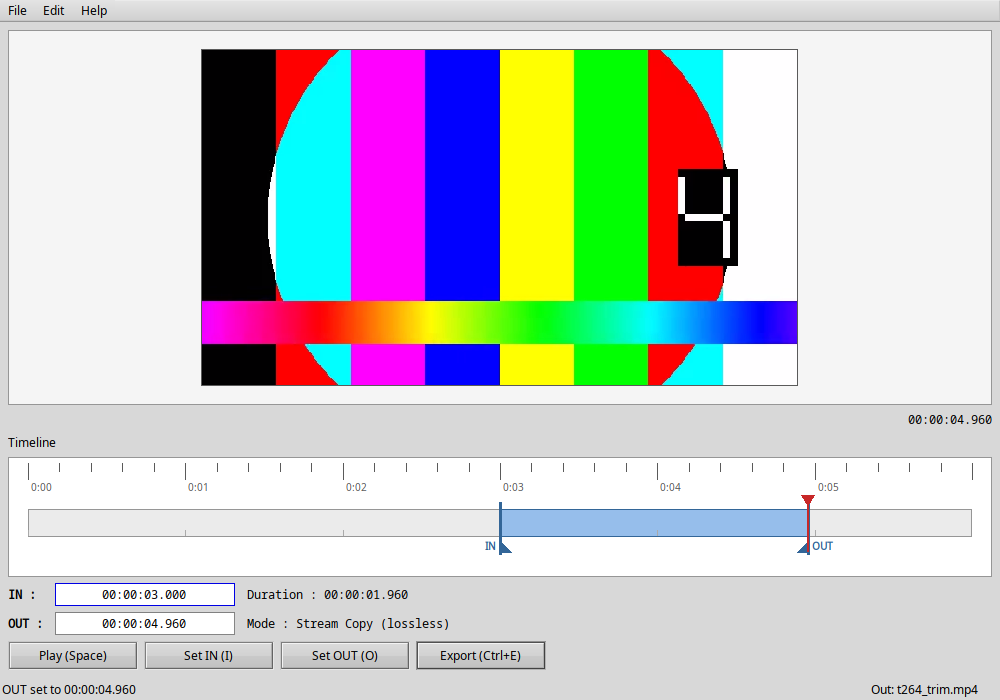

# TrimFast

**Cut a video without re-encoding it.** Pick where it should start and end, press export:
picture, audio, subtitles, chapters and metadata are copied exactly as they were, in seconds.

TrimFast is for tidying up clips you have already shot, not for editing: no effects, no titles,
no transitions. It is small, starts instantly, works from the keyboard, and keeps to itself (no
network, no telemetry, no cloud). Made for **Haiku** first; it also runs on **Linux**.



* **Lossless**: FFmpeg *stream copy*. There is no setting that re-encodes.
* **Keyboard first**: I and O mark the part to keep, Ctrl+E exports.
* **Safe**: an export either completes or leaves nothing behind; existing files are never overwritten
  without asking; the result is checked against the original.
* **Insta360** `.insv`: both lens files are cut together and the camera data is kept.

Home page: <https://github.com/taoman26/TrimFast>  
Downloads: [Releases](https://github.com/taoman26/TrimFast/releases) · Bug reports and ideas: [Issues](https://github.com/taoman26/TrimFast/issues)  
The current version and what changed in each: [CHANGELOG.md](CHANGELOG.md).

## Install

Download the files from the [Releases page](https://github.com/taoman26/TrimFast/releases).

### Haiku

Double-click `TrimFast-<version>-1-x86_64.hpkg` (it opens the package installer) or copy it to
`~/config/packages/`. It depends on `qt6_base`, `qt6_multimedia` and `ffmpeg8_tools`, which Haiku
fetches for you. TrimFast then appears in the Deskbar's Applications menu and is offered by
Tracker's *Open With* for video files.

### Linux

Download `TrimFast-<version>-x86_64.AppImage`, make it executable and run it. It carries its own
Qt, so it works where the distribution's Qt is too old.

```
chmod +x TrimFast-*.AppImage
./TrimFast-*.AppImage [video]
sudo apt install ffmpeg          # the one thing it needs besides a normal desktop
```

* Needs **ffmpeg and ffprobe** (not bundled), **glibc ≥ 2.35** (Ubuntu 22.04, Debian 12, Fedora 36
  or newer) and the system's OpenGL libraries (`libgl1`, `libopengl0`, `libegl1`: any desktop has
  them; they must match the graphics driver, so they are not bundled).
* X11 and Wayland (the Wayland plug-in is bundled, but only X11 has been tried). Without FUSE:
  `--appimage-extract-and-run`.
* For a menu entry use AppImageLauncher or appimaged, or install from source.

### From source

```
git clone https://github.com/taoman26/TrimFast.git
cd TrimFast
```

Needs Qt ≥ 6.5 (Widgets and Multimedia), CMake ≥ 3.21 and a C++20 compiler; at run time `ffmpeg`
and `ffprobe`. See [Build](#build).

## Use

```
trimfast [video]            trimfast --help        trimfast --version
```

Open a video (Ctrl+O, drag & drop, the command line or the file manager), move to where the clip
should start and press **I**, move to where it should end and press **O**, then **Ctrl+E**.
The result is saved next to the original as `name_trim.ext` (`name_trim_2.ext`, … if that exists);
the save dialog lets you choose another name. (Insta360 recordings are named differently, see below.)

| Key | Action | Key | Action |
|---|---|---|---|
| Ctrl+O | Open | Space | Play / pause |
| I / O | Set IN / OUT | Alt+I / Alt+O | Jump to IN / OUT |
| ← / → | 1 frame back / forward | Shift+← / → | 1 second |
| Ctrl+← / → | Previous / next keyframe | Home / End | Start / end |
| K / L | Pause / play | Ctrl+E | Export |
| Esc | Cancel an export | Ctrl+Q | Quit |

With the mouse: click or drag on the timeline to seek; drag the blue IN/OUT markers to change the
range. *Edit > Clear IN/OUT* selects the whole file again. The range is remembered for each file.

### What "lossless" means here

* The cut can only **start on a keyframe**, so IN snaps back to the previous one (the status line
  tells you). The small ticks on the timeline and Ctrl+←/→ show where the keyframes are.
* The **end** is accurate to the frame, plus the few frames a codec reorders; it is not an exact
  frame cut. Anything more precise needs re-encoding, which TrimFast never does.
* Nothing is ever converted: if the container cannot hold one of the streams, the export fails
  and shows FFmpeg's message.
* Everything else is copied as it is, including thumbnails or cover pictures a camera or app has
  embedded in the file: they still show what they showed before the cut. (For Insta360 files
  TrimFast removes the camera's preview pictures, see below.)

### Insta360

Opening `VID_…_00_….insv` also finds `VID_…_10_….insv` (the status line shows *Pair: … found*).
One export cuts both with the same range, and either both are written or neither.

**File names matter.** The Insta360 apps recognise the two lens files as one video by their names,
`VID_<date>_<time>_00_<serial>.insv` and `…_10_…`. So Insta360 files get no `_trim` suffix: the
copy keeps the pattern and its time is moved forward by one second (more if taken), e.g.
`VID_20260923_105656_00_082.insv` next to the original `…105655…`. If you type another name in the
save dialog, TrimFast asks first when it breaks the pattern.

What is kept of the camera's own data:

* The block at the **end** of the `_00_` file (lens calibration, gyro and accelerometer data,
  exposure) is carried over **adapted to the clip**: the motion data is cut to the exported part and
  moved to start with it. This is what keeps Insta360 Studio's **stabilisation** working; with the
  untouched data of the whole recording Studio switches it off for a trimmed clip.
* That block also holds two full-resolution **preview pictures of the original recording**
  (thumbnails). They could show footage you cut away, so they are removed.
* If the block has a layout TrimFast does not know (another camera model: only a ONE X2 has been
  examined), it is copied unchanged and the export warns you: the stabilisation may then not work.
* The MP4 header is written anew by FFmpeg, which drops the small vendor atom `AMBA` (107 bytes,
  named after the camera's chip; its purpose is unknown). TrimFast puts it back, identical, in
  every exported `.insv`. Only `AMBA` is restored: other vendors' atoms could describe the original
  timeline, so they are not copied blindly.
* Checked with Insta360 Studio on one ONE X2 recording: a trimmed pair named as above opens as one
  video, and stabilisation and horizon levelling work. Other camera models have not been tried.

### Files and settings

Settings are plain text files; there is no settings window.

| | Linux | Haiku |
|---|---|---|
| Folder | `~/.config/TrimFast/` | `~/config/settings/TrimFast/` |
| `session.ini` | IN/OUT of the last 50 files, last file | the same |
| `settings.ini` | optional, see below | the same |

```ini
; the programs to use (default: found on PATH)
[tools]
ffmpeg=/opt/ffmpeg/bin/ffmpeg
ffprobe=/opt/ffmpeg/bin/ffprobe

; added to the name of the exported file (default: _trim)
[output]
suffix=_cut
```

Environment: `TRIMFAST_AUDIO=0|1` (sound off/on; off by default on Haiku), `TRIMFAST_PERF=1|quit`
(prints start-up timings).

### If something goes wrong

| Message / symptom | Do |
|---|---|
| "ffprobe was not found" / "ffmpeg was not found" | Install FFmpeg, or set `[tools]` above |
| `libOpenGL.so.0: cannot open shared object file` (AppImage) | `sudo apt install libopengl0` |
| "IN moved to the previous keyframe" | Normal: a lossless cut starts on a keyframe |
| Export refused: FAT volume, 4 GiB | Choose a folder on another file system |
| "There may not be enough free space" | The OS numbers can be wrong; you may continue |
| No sound on Haiku | Off by default; try `TRIMFAST_AUDIO=1` |

## Build

```
cmake -S . -B build -DCMAKE_BUILD_TYPE=Release
cmake --build build -j4
./build/trimfast
```

**Haiku**: `pkgman install qt6_base_devel qt6_multimedia_devel ffmpeg8_devel ffmpeg8_tools cmake`.
Use `-j3` or less (a parallel `make -j8` can stall a small VM).

**Linux**: Ubuntu 22.04's Qt 6.2 is too old (GStreamer backend, no AAC/HEVC without plug-ins). Use a
newer Qt, for example `pip install aqtinstall && aqt install-qt linux desktop 6.10.3 linux_gcc_64
-m qtmultimedia -O ~/Qt`, and add `-DCMAKE_PREFIX_PATH=$HOME/Qt/6.10.3/gcc_64`.
`cmake --install build --prefix /usr` installs the program, a `.desktop` file, AppStream data and icons.

### Test

```
scripts/run_tests.sh                       # build + all tests (makes a small test clip)
SANITIZE=1 scripts/run_tests.sh            # with AddressSanitizer + UBSan (Linux)
```

GUI tests run headless (Qt's `offscreen` platform) where there is no display. Optional inputs:
`TRIMFAST_TEST_INSV` (a real Insta360 pair) and `TRIMFAST_TEST_LONG` (a one-hour clip). What cannot
be automated is listed in [docs/manual_test_checklist.md](docs/manual_test_checklist.md);
measurements are in [docs/performance.md](docs/performance.md).

### Packages

```
LICENSE=MIT packaging/haiku/build_hpkg.sh                                  # on Haiku -> .hpkg
QT_PREFIX=$HOME/Qt/6.10.3/gcc_64 packaging/linux/build_appimage.sh         # on Linux -> AppImage
```

Both are described, with the checks to run, in [docs/releasing.md](docs/releasing.md).

## Project

```
src/core/      Qt-only logic: ffprobe, FFmpeg runner, markers, sessions, Insta360 data, checks
src/playback/  QMediaPlayer wrapper (preview only: export never goes through it)
src/ui/        the timeline and video widgets          src/app/   the main window
tests/         QtTest unit and integration tests       packaging/ Haiku package, Linux AppImage
design.md  architecture.md  implementation_plan.md  docs/
```

The design documents explain why things are the way they are ([design.md](design.md): the
interface; [architecture.md](architecture.md): the classes and what was measured).

## Contributing and bug reports

Questions, bug reports and ideas: [GitHub Issues](https://github.com/taoman26/TrimFast/issues). For a bug, please say which system
(Haiku or Linux and the distribution), the version (`trimfast --version`) and, if you can, what
`TRIMFAST_PERF=1` or the status line shows. For a problem with a camera file, the camera model helps
most. Run `scripts/run_tests.sh` before sending changes.

## Versions and changes

[CHANGELOG.md](CHANGELOG.md) lists what changed in each version. Versions are `MAJOR.MINOR.PATCH`;
the number is set in one place and checked by `scripts/version.py` (see
[docs/releasing.md](docs/releasing.md)).

## Licence

MIT, see [LICENSE](LICENSE). Qt and FFmpeg are not part of TrimFast: they are separate packages,
installed alongside and used under their own licences.
