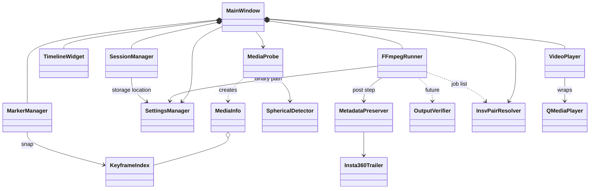

# TrimFast Architecture (Phase C)

コードは含まない。クラス名・責務・依存関係・ディレクトリ構成のみ。
前提: C++20 / Qt6 Widgets / CMake / FFmpeg。QML・Electron・Chromium・テレメトリ・ネットワーク機能なし。

---

## 1. 設計原則

1. **Core と UI の分離**: `core/` は Qt Widgets に依存しない（QtCore のみ可）。テストとCLI化が容易。
2. **書き出しは ffmpeg 外部プロセス**: `ffmpeg` / `ffprobe` を `QProcess` で起動する。ライブラリリンクしない。ライセンス境界が明確で、Haiku/Linux/Windows でバイナリ差し替えだけで済む。
3. **再生と書き出しは完全に別系統**: 再生は「見るため」、書き出しは「無劣化コピー」。両者は時刻（ミリ秒）の値だけで接続する。
4. **再エンコード禁止を型で守る**: ffmpeg 引数は `FFmpegRunner` 内の唯一のビルダーが生成し、`-c copy` を固定で含む。外部から codec 指定を受け付けない。
5. **状態の単一所有**: IN/OUT は MarkerManager、現在位置は VideoPlayer、ファイル情報は MediaInfo が持つ。MainWindow は仲介のみ。

---

## 2. クラス一覧と責務

| クラス | 層 | 責務 | 持たない責務 |
|---|---|---|---|
| **MainWindow** | ui | 全体レイアウト、メニュー、ショートカット登録、各部品の配線（signal/slot）、ステータスバー更新、D&D受付 | 動画デコード、ffmpeg引数、IN/OUT状態保持 |
| **VideoPlayer** | playback | QMediaPlayer のラッパー（Widgets 非依存）。再生/一時停止/シーク/コマ送り/先頭末尾移動、位置・再生状態・エラーの通知。映像は `videoSink()` から取り出して VideoSurface が描画。**音声は Haiku では既定OFF**（下記）| トリム判断、書き出し |
| **TimelineWidget** | ui | ルーラー/トラック/IN-OUT範囲/再生ヘッド描画、クリック・ドラッグでシーク、マーカードラッグ、ズームは将来 | 時刻の確定値保持（表示用コピーのみ） |
| **MarkerManager** | core | IN/OUT の保持、検証（IN<OUT）、キーフレーム吸着後の値管理、変更通知。将来は複数区間 | 描画、再生 |
| **FFmpegRunner** | core | Stream Copy 書き出しの引数生成と実行、進捗解析（`-progress pipe:1`）、キャンセル、エラー整形。**ペア時は同一区間で入力ごとに順次実行し、全体進捗を合成**。1つでも失敗したら先に完成した出力も削除（全成功か全削除） | 再生、UI表示 |
| **SessionManager** | core | 最後に開いたファイルと IN/OUT の保存・復元（ローカルのみ） | 設定値（SettingsManagerの責務） |
| **SettingsManager** | core | ffmpeg/ffprobe パス、既定出力先、サフィックス規則、ウィンドウ位置の保存（QSettings系） | セッション状態 |
| **MediaProbe**（追加） | core | ffprobe を実行し JSON を解析して `MediaInfo` を返す。ストリーム/チャプター/メタデータ/360度判定 | 再生 |
| **MediaInfo**（追加・値型） | core | duration、fps、ストリーム一覧、チャプター、フォーマットタグ、SphericalInfo、キーフレーム時刻リスト | ロジック |
| **KeyframeIndex**（追加） | core | ffprobe でキーフレームPTS一覧を取得し、「直前/直後のキーフレーム」を返す。IN吸着に使う | 描画 |
| **SphericalDetector**（追加） | core | 360度動画の判定とカメラ種別（Insta360 / GoPro Max / Theta / 不明）の識別、保持すべきメタデータの列挙 | 書き換え |
| **MetadataPreserver**（追加） | core | 書き出し後に失われがちなメタデータを検証・必要なら再注入。Insta360 は `Insta360Trailer` を使って末尾トレーラを出力へ追記 | 通常メタデータ（ffmpegに任せる） |
| **InsvPairResolver**（追加） | core | Insta360 の `_00_` / `_10_` ペア検出（同一ディレクトリ・同一タイムスタンプ・連番部一致）。ペアの全ファイル一覧と、各ファイルの MediaInfo 整合性（duration/fps/解像度）チェック | 書き出し実行 |
| **Insta360Trailer**（追加） | core | `.insv`/`.lrv` 末尾トレーラ（`[size u32][ver u32][magic 32B]`）の検出・読み出し・追記。MP4 本体は触らない | 内部レコードの解釈（初期版は不透明データとして扱う） |
| **OutputVerifier**（追加・将来） | core | 入力と出力の ffprobe 結果を比較し差分をレポート | UI |
| **TimeFormat**（追加・ユーティリティ） | core | ms ⇄ `HH:MM:SS.mmm` 変換 | — |
| ~~PlaybackBackend（抽象）~~ | — | **廃止（Step 2 の実測で不要と判断）**。Haiku でも Qt Multimedia（FFmpeg バックエンド）で H.264/HEVC/2880x2880 が再生・シークできたため、VideoPlayer が QMediaPlayer を直接ラップする。LibavBackend / QtMultimediaBackend は作らない | — |
| **ToolLocator**（追加） | core | ffmpeg / ffprobe を PATH から探す（Step 5 で SettingsManager の上書きに接続） | — |

PlaybackBackend の実装候補は §6 のオープン課題を参照。

---

## 3. クラス図



### 主要なシグナルの流れ（文章）

- `VideoPlayer.positionChanged(ms)` → MainWindow → `TimelineWidget.setPosition(ms)` / 時刻ラベル更新
- `TimelineWidget.seekRequested(ms)` → MainWindow → `VideoPlayer.seek(ms)`
- ユーザーが I キー → MainWindow が VideoPlayer の現在位置を取得 → `MarkerManager.setIn(ms)`（キーフレーム吸着）→ `markersChanged` → Timeline と IN/OUT ラベルが更新
- Ctrl+E → MainWindow が MarkerManager の区間と MediaInfo を `FFmpegRunner.start(...)` へ渡す → `progress(%)` → ステータスバー → `finished(result)` → 完了表示（任意で OutputVerifier）

---

## 4. Stream Copy 書き出し仕様（設計）

### 基本方針
- 出力は **入力と同一コンテナ・同一コーデック**。`-c copy` 固定。再エンコード系オプション（`-vf`, `-af`, `-crf` 等）は一切生成しない。
- 全ストリーム保持: `-map 0`（映像/音声/字幕/データ/添付すべて）。
- メタデータ保持: `-map_metadata 0`、チャプター保持: `-map_chapters 0`。
- 未知データストリーム（GoPro の gpmd、Insta360 の独自データ等）保持: `-copy_unknown` 相当を使う。
- 範囲指定は **入力側 `-ss`（高速シーク）** を基本とし、終端は `-to`（入力側 `-ss` 使用時は出力タイムスタンプ基準になる点に注意し、実装時は `-t`（長さ）での指定を採用）。
- `-avoid_negative_ts make_zero` で先頭のタイムスタンプ負値を防ぐ。
- IN はキーフレームへ吸着（UI で明示）。OUT はキーフレーム境界でなくてもコピー可能だが、映像は直前のフレームまでで切れる。

### 引数の概念形（参考。実装コードではない）

```
ffmpeg -ss IN -i input -t (OUT-IN) -map 0 -c copy
       -map_metadata 0 -map_chapters 0 -copy_unknown
       -avoid_negative_ts make_zero  output
```

### 既知のリスク（Phase E 前に実機検証すべき項目）
| リスク | 内容 | 方針 |
|---|---|---|
| 字幕コーデックとコンテナ | mp4 は一部字幕（PGS 等）非対応 | 入力と同コンテナ出力なので通常は問題なし。非対応時は事前検出しエラー表示（再エンコードで逃げない） |
| 先頭の非キーフレーム | IN 直後に参照フレーム欠落で数フレーム壊れる | キーフレーム吸着で回避 |
| データストリームの欠落 | ffmpeg が未対応 codec_type を落とす | `-copy_unknown` ＋ 出力後の ffprobe 照合 |
| タイムコード/リール名 | mov の tmcd トラックは編集で値がずれる | 範囲に応じ再計算の要否を検証（P2） |
| 4GB 超 | FAT 系出力先 | 出力先FS検査して警告 |

---

## 5. 360度動画対応（設計）

### 対象と想定ファイル
| カメラ | 典型ファイル | 想定される保持対象 | 留意点 |
|---|---|---|---|
| **Ricoh Theta** | `.MP4`（equirectangular 済） | Spherical V1 の `uuid` box（XML）、projection、ジャイロ/EXIF 系 | ffmpeg は `uuid` box を保持しない可能性が高い → **MetadataPreserver で再注入**が必要 |
| **GoPro Max** | `.360`（2ストリーム HEVC＋gpmd）／書き出し済み equirect `.MP4` | `.360` は独自レイアウト、GPMF テレメトリ（gpmd）、`st3d`/`sv3d` | `.360` は **stream copy で全ストリーム保持**が必須。再エンコード・結合は禁止。gpmd 保持を最優先で検証 |
| **Insta360** | `.insv`（1レンズ=1ファイル。`_00_` と `_10_` の2ファイルで1動画）／`.lrv`（プロキシ）／`.mp4`（equirect 書き出し済） | 末尾トレーラ（キャリブレーション、ジャイロ等）、projection | **実測済み（§5.1、§13〜§15）**: ffmpeg の stream copy は末尾トレーラを必ず落とす → `Insta360Trailer` で追記が必須（P1）。ペアは §5.1 |

### 5.1 Insta360 ペアファイル対応（方式B：自動検出・同時書き出し）

- `_00_` または `_10_` を開くと `InsvPairResolver` が相方を探す（同ディレクトリ、名前の `_00_`⇄`_10_` 置換が存在し、duration/fps/解像度が整合）。
- プレビューは開いたファイル側のみ表示（投影変換はしない）。ステータスバーに `Pair: _10_ found` を表示。相方が無い/不整合なら `Pair: not found (single file)` と警告し、単体で動作。
- IN/OUT は1組。Export は同一区間を両ファイルに適用し、出力は `元名_trim` を各ファイルに付与（`_00_`/`_10_` の並びは維持）。
- 各ファイルのキーフレーム位置が異なる場合、**IN は両方の「直前キーフレーム」のうち遅い方**ではなく、各ファイルで個別に吸着する。ずれが 1 フレーム周期を超えるときは警告（要実機確認。両レンズは同期録画のため通常は一致）。
- **実測（ONE X2 の1録画 `VID_20260923_105655_00_082.insv` / `_10_082.insv`）**: 両ファイルとも 2880x2880 H.264 / 25 fps / AAC。`_00_` は 4203 フレーム（168.12 s）、`_10_` は 4202 フレーム（168.08 s）で **1 フレーム短い**ため、整合チェックの長さの許容差は約 2 フレーム周期とする。作成時刻（creation_time）は同一。MP4 部分はどちらも 964,689,920 bytes（920 MiB。`free` で整列）で、**キーフレームは 263 個・0.64 秒間隔で完全に一致**する（IN の吸着は両側で同じ時刻になる）。Insta360 トレーラ（9,348,672 bytes）は **`_00_` のみ**にあり、`_10_` の出力には追記しない。同一の IN/OUT を両方に適用すると、出力は同じ長さで同期したまま切り出せる（`-ss 20 -t 10` で両方 10.176 s）。`.lrv`（`LRV_…_11_…insv`、736x368 H.264、43 s）にも同形式のトレーラ（1,533,046 bytes、version 3）がある。**ffmpeg の stream copy はこのトレーラを必ず落とす**（`-copy_unknown` でも同じ。トレーラは「ストリーム」ではなく MP4 の外にあるため）。
- 全成功か全削除（片方だけの出力を残さない）。
- `.lrv`（プロキシ）はペアではなく、対応する本体 `.insv` の存在を検出して「プロキシを開いている」旨を表示（本体の自動トリムは将来検討）。

### 5.2 Insta360 トレーラ方針（実測に基づく）

- 末尾構造: `[...data...][size u32 LE][version u32 LE = 3][magic 32B 8db42d694ccc418790edff439fe026bf]`。MP4 本体は `ftyp/mdat/moov/free` で終わり、`free` で整列された後ろにトレーラが続く。
- 初期版: **トレーラを丸ごと出力 MP4 の末尾に追記**（不透明データ扱い）。キャリブレーション情報は保持される。ジャイロ等の時系列データは元の時間軸のままで、トリム後とは時間がずれる旨を Export 完了時のステータスに明記。
- 将来: 内部レコード解析による時間範囲の切り詰め（仕様非公開・要調査）。
- 追記後、`ffprobe` が出力を引き続き正常に読めることを検証する（追記は MP4 の外側なので通常問題なし）。Insta360 Studio 等での読み込み可否は未検証。

### 保持対象（要件）
- **Spherical Metadata**: Google Spherical Video V1（`uuid` XML）、V2（`st3d` / `sv3d`）。
- **Projection Metadata**: equirectangular / cubemap / 魚眼、ステレオモード、初期視点（yaw/pitch/roll）。
- **Camera Metadata**: メーカー/機種タグ、gpmd・ジャイロ・加速度データストリーム、トレーラ。

### 確認方法
- `MediaProbe` が `ffprobe -show_format -show_streams -show_chapters -show_entries stream_side_data -print_format json` で取得し、`SphericalDetector` が判定。
- 書き出し直後に同じ ffprobe を出力へ実行し、Spherical/Projection/Camera の項目が入力と一致することを確認（初期は警告表示のみ）。

### 将来: 出力前後の差分チェック
- `OutputVerifier` が入力/出力の ffprobe JSON を正規化して比較。
- 比較項目: ストリーム数・codec・解像度・fps・ビットレート（許容差あり）、チャプター、format/stream タグ、side_data（spherical）、データストリーム存在、duration（範囲±1GOP を許容）。
- 結果は PASS / WARN / FAIL。File > Verify Output で手動実行。UI は標準ダイアログ1つのみ。

---

## 6. オープン課題（Phase E 前に確認）

| # | 課題 | 選択肢 | 現時点の推奨 |
|---|---|---|---|
| 1 | ~~Haiku での再生バックエンド~~ **解決（Step 2）: Qt Multimedia を採用**。以下は検討時の記録: | (a) Qt Multimedia, (b) FFmpeg ライブラリ（libavcodec/libswscale）で自前デコードし QImage 表示, (c) libmpv 組込み | PlaybackBackend 抽象を置き、**(b) を主、(a) を Linux 補助**。音声出力は QAudioSink or 別実装が必要（要調査） |
| 2 | Haiku 上の Qt6 の入手性とバージョン | HaikuDepot のパッケージ確認 | 実機/VM で `cmake` 通しを Step 1 前に確認 |
| 3 | uuid box 再注入の実装方法（Theta 用。Insta360 は §5.2 で確定）| 自前の最小 MP4 box ライタ / 外部ツール | 自前の最小実装（box 追記のみ。再エンコードなし） |
| 4 | 360度の実ファイル入手 | 各社サンプル | テスト用に短尺サンプルを用意（リポジトリには含めない） |
| 5 | 音声付き再生の A/V 同期 | オーディオクロック主導 | 初期版は映像のみ＋音声は後続でも可（トリム用途のため） |

---

## 7. ディレクトリ構成

```
TrimFast/
├── CMakeLists.txt
├── README.md
├── design.md                  # Phase B
├── architecture.md            # Phase C（本書）
├── implementation_plan.md     # Phase D
├── mockup_main_window.png
├── make_mockup.py
├── cmake/
│   └── FindFFmpeg.cmake       # pkg-config 非対応環境用
├── src/
│   ├── main.cpp
│   ├── app/
│   │   └── MainWindow.{h,cpp}
│   ├── ui/
│   │   ├── TimelineWidget.{h,cpp}
│   │   └── VideoSurface.{h,cpp}     # 描画面
│   ├── playback/
│   │   └── VideoPlayer.{h,cpp}          # QMediaPlayer ラッパー
│   └── core/                        # Qt Widgets 非依存
│       ├── MarkerManager.{h,cpp}
│       ├── FFmpegRunner.{h,cpp}
│       ├── MediaProbe.{h,cpp}
│       ├── MediaInfo.h
│       ├── KeyframeIndex.{h,cpp}
│       ├── SphericalDetector.{h,cpp}
│       ├── MetadataPreserver.{h,cpp}
│       ├── InsvPairResolver.{h,cpp}
│       ├── Insta360Trailer.{h,cpp}
│       ├── OutputVerifier.{h,cpp}   # 将来
│       ├── SessionManager.{h,cpp}
│       ├── SettingsManager.{h,cpp}
│       └── TimeFormat.{h,cpp}
├── tests/
│   ├── CMakeLists.txt
│   ├── tst_timeformat.cpp
│   ├── tst_markermanager.cpp
│   ├── tst_ffmpegargs.cpp           # 引数に -c copy が必ず入り再エンコード系が無いこと
│   ├── tst_mediaprobe.cpp
│   ├── tst_spherical.cpp
│   ├── tst_insvpair.cpp
│   ├── tst_insta360trailer.cpp
│   └── data/                        # 極小のテスト動画（生成スクリプトで作る）
├── scripts/
│   └── make_test_media.sh           # ffmpeg で短尺テスト動画を生成
└── packaging/
    ├── haiku/                       # .hpkg 用 recipe
    └── linux/                       # .desktop など
```

CMake ターゲット: `trimfast_core`（静的ライブラリ、QtCore のみ）← `trimfast_playback` ← `trimfast`（実行ファイル）、`trimfast_tests`。

---

## 8. Step 2 で確定した事項（実測）

- **再生**: Haiku R1/beta6 + Qt 6.10.3 の Qt Multimedia は FFmpeg 6.1.6 バックエンドで動作。H.264 / HEVC / MPEG-4 を再生でき、シーク・前後コマ送りも期待どおり（tst_videoplayer、640x360 H.264/HEVC と 2880x2880 H.264 で通過）。HW デコーダは無く、ソフトウェアデコード。
- **音声（Haiku）**: `QAudioOutput` を付けると、検証 VM では `BMediaRoster::Connect` がタイムアウトし `Failed to create audio context` のあと **SIGSEGV でクラッシュ**。音声はトリム位置の判断に必須ではないため、**Haiku では既定で音声OFF**（`TRIMFAST_AUDIO=1` で有効化可）。Linux は既定ON（`TRIMFAST_AUDIO=0` で無効化可）。実機（非VM）での音声の可否は未確認。Step 5 の SettingsManager で設定項目化する。
- **Qt の一覧表示**: `QMediaFormat::supportedVideoCodecs` は Haiku で H.264/HEVC を列挙しないが、実際には再生できる（この一覧は当てにしない）。
- **コマ送り**: QMediaPlayer にコマ送り API は無いため、`pause + setPosition(round((n±1)*1000/fps))` で実装。位置は VideoPlayer が保持（一時停止中は自前、再生中は QMediaPlayer の通知）。

### Linux 開発環境メモ（Step 2 検証で判明）
- Ubuntu 22.04 標準の Qt 6.2 は Multimedia が **GStreamer バックエンド**（FFmpeg ではない）。デコーダ（gst-libav）が無いと AAC/HEVC が再生できず、HEVC では異常終了する。TrimFast が前提とする Qt Multimedia の挙動は **Qt 6.5 以降の FFmpeg バックエンド**（Haiku は 6.10.3）。
- Linux では Qt 6.10.3 を `aqtinstall` でホーム配下に導入して検証した: `aqt install-qt linux desktop 6.10.3 linux_gcc_64 -m qtmultimedia -O ~/Qt` → `cmake -DCMAKE_PREFIX_PATH=$HOME/Qt/6.10.3/gcc_64`。H.264/HEVC/2880x2880 と音声あり/なしの全てで tst_videoplayer 通過（FFmpeg 7.1.3 バックエンド）。
- **要件**: TrimFast の動作保証は Qt 6.5 以上（FFmpeg バックエンド）。CMake 側で `find_package(Qt6 6.5 ...)` とするのが妥当（次の機会に反映）。

---

## 9. Step 5 で確定した事項（実測）

- **引数は FFmpegRunner::buildArgs の1か所のみ**で生成。許可リスト方式のテスト（`tst_ffmpegargs`）で、`-hide_banner -nostdin -v -nostats -progress -ss -i -t -map -c(=copy) -map_metadata -map_chapters -copy_unknown -avoid_negative_ts -f -n/-y` 以外のオプションが出ないことを保証。`Job` には codec/filter/品質のパラメータが存在せず、再エンコードを要求する手段が無い。
- **パスは常に絶対パス化**（`-` 始まりのファイル名がオプション扱い、`xxx:` がプロトコル扱いされるのを防ぐ）。空白・日本語・引用符を含むパスもテスト済み。
- **上書き保護は二重**: `start()` が既存出力を拒否（`overwrite=false` 既定）＋ ffmpeg 側 `-n`。入力と同一パスの出力も拒否。
- **キャンセル**: `kill` して部分ファイルを削除。失敗時（ffmpeg 異常終了・出力 0 byte）も部分ファイルを削除。
- **進捗**: `-progress pipe:1` の `out_time_us/out_time_ms`（どちらもマイクロ秒）から算出。終了までは最大 99%、成功で 100%。
- **`.insv` / `.lrv` の出力**: 拡張子から ffmpeg が muxer を選べないため `-f mp4` を付与（`OutputPath::forcedFormat`）。付けないと失敗し、出力を残さない（テスト済み）。
- **無劣化の実証**: 出力の映像パケットのサイズ列が、入力の該当範囲と一致（`tst_ffmpegrunner`）。実物の Insta360 `_00_`/`_10_`（2880x2880）でも、同一範囲 [1.280 s, +5.120 s] で入出力 128 パケットが完全一致し、両ファイルとも 5.12 s で同期を保った。
- **終端の精度（stream copy の性質）**: `-t` は復号順のタイムスタンプで判定されるため、OUT は「フレーム精度＋B フレーム並べ替え分（実測 +2 フレーム程度）」の誤差を持つ。映像と音声の開始は `-avoid_negative_ts make_zero` で揃えられるが、映像の開始が 0.09 s ほどずれることがある（B フレーム遅延）。IN は MarkerManager がキーフレームに吸着するので正確。
- **ToolLocator**: SettingsManager の ffmpeg/ffprobe パスで上書き可能。上書きが使えない場合は PATH にフォールバックしない（ユーザーの指定を黙って無視しない）。
- **Export の暫定仕様（Step 6 で拡張）**: 出力は入力の隣の `元名_trim.拡張子` 固定。既存なら失敗として通知し、上書きしない。

---

## 10. Step 6 で確定した事項（実測）

- **ExportCoordinator（全成功か全削除）**: 各ファイルを `<名前>.trimfast-partial.<拡張子>` という一時名で順に書き出し、**全ファイルが成功・検証通過してから最終名へリネーム**。失敗・キャンセル時は一時ファイルを全削除し、既存ファイルには触れない（`overwrite=true` でも、最後のリネームまで旧ファイルは残る）。同一出力名の重複は開始前に拒否。
- **Insta360 トレーラ**: `[size u32][version u32][magic 32B]`（リトルエンディアン、size はフッタ込みの全長）。`Insta360Trailer` が検出し、出力 MP4 の末尾にバイト列そのまま追記。実物ペアで `_00_` 側の出力に元と完全に同じ 9.3 MB が付くことを確認。内部レコードは解釈しないため、**ジャイロ等は元の時間軸のまま**（完了時に通知）。`_10_` にはトレーラが無いので追記もしない。Insta360 公式ソフトでの読み込み可否は**未検証**。
- **ペア（方式B）**: `InsvPairResolver` が `_00_`⇄`_10_` を導出。開いた直後に相方を ffprobe し、解像度・fps が同じで長さの差が 100 ms 以内なら「Pair: … found (both are exported)」。保存ダイアログで選んだ名前の `_00_`/`_10_` を入れ替えて相方の出力名を決める（トークンが無い名前なら相方自身の名前＋`_trim`）。相方の IN にキーフレームが無ければ警告。
- **出力後の照合（OutputVerifier）**: 入力と出力の ffprobe を比較し、ストリーム種別・codec・解像度、チャプター消失、コンテナタグ、サイド情報（Spherical 等）の欠落を警告として表示。出力が読めない場合は失敗扱い（全削除）。ffmpeg が書き換える `encoder` / `major_brand` 等は無視。
- **容量チェック**: FAT 系で 4 GiB 以上は**書き出しを止める**。空き容量不足の可能性は**確認ダイアログ（続行可）**。**Haiku の packagefs（/tmp など）は「0 of 0 bytes」を返す**ため、全容量が 0 以下の値は「不明」として扱う（これを誤って「容量不足」とした不具合を実機で発見・修正）。bfs（/boot/home）は正しい値を返す。
- **出力名**: 既定は `元名_trim` → 既存なら `_trim_2`, `_trim_3` …（ペアは両方が空く番号）。保存ダイアログで拡張子を変えても入力と同じ拡張子を維持。
- **Haiku 開発メモ**: VM 上で `make -j8`（多数ターゲット）が互いに待ち合って固まることがある。`-j3` で安定。テストは `ctest --timeout` を付ける。

---

## 11. Haiku パッケージ化（hpkg）で確定した事項

- **作成**: `packaging/haiku/build_hpkg.sh`（Haiku 上で実行）。`cmake` でビルド → `strip` → `rc`/`xres` でアプリリソース（シグネチャ `application/x-vnd.TrimFast`、バージョン情報、対応ファイルタイプ `video`）を埋め込み → `mimeset -f` → `package create`。出力は 136 KB 程度。
- **構成**: `apps/TrimFast`、`bin/trimfast`（シンボリックリンク）、`data/deskbar/menu/Applications/TrimFast`（Deskbar メニュー）、`data/licenses/<名前>`、`documentation/packages/trimfast/`、`.PackageInfo`。
- **依存**: `lib:libQt6Core/Gui/Widgets/Multimedia >= 6.5`、`cmd:ffmpeg >= 5`、`cmd:ffprobe >= 5`、`haiku >= r1~beta5`。`pkgman resolve-dependencies` で `qt6_base`・`qt6_multimedia`・`ffmpeg8_tools` に解決されることを確認（実機へのインストールはしていない）。
- **ライセンスは必須入力**: Haiku は `.PackageInfo` に挙げたライセンスの本文をパッケージ内に要求する（無いと `package create` が失敗）。プロジェクトのライセンスは著者の決定事項のため、既定値を持たせず `LICENSE=` の指定を必須にした。
- **ファイルを開く経路（実機で発見・修正した不具合）**: Haiku では Tracker の「Open With」・ダブルクリックは、コマンドライン引数ではなく `B_REFS_RECEIVED` で渡される。Qt の Haiku プラットフォームプラグインはこれを `QFileOpenEvent` に変換するが、TrimFast は処理しておらず、**空のウィンドウが開くだけだった**。`TrimFastApplication`（QApplication 派生）が `QFileOpenEvent` を受け、ウィンドウ生成前に届いた要求は保持して後で渡す。`B_SINGLE_LAUNCH` なので、起動中に別のファイルを開くと同じウィンドウに読み込まれる。ファイルに「優先アプリ」属性を付けて `open` で開く方法（Tracker と同じ起動経路）で、パッケージ版が起動してファイルを読み込むことを実機で確認。
- **アイコン（HVIF ベクターアイコン、242 バイト）**: `packaging/haiku/make_icon.py` が図形を1か所で定義し、HVIF（`trimfast.hvif`）・リソース定義（`trimfast_icon.rdef`、`rc` が `VICN`/101/`BEOS:ICON` として取り込む）・プレビュー PNG（`docs/icon.png`、`docs/icon_sizes.png`）を同じ定義から生成する。意匠は「ビデオ画面と再生マーク」の下に「タイムライン」（黄色の選択範囲と赤の IN/OUT マーカー）。16px でも読み取れる単純な平面色。`hvif.py`（読み書き）は、**実物のシステムアイコン（DeskCalc、374 バイト）を最後の 1 バイトまで読めること**で形式の理解を検証してから書いた（スタイル種別 4=グレー+アルファ、5=グレー、のみ最初の理解が逆だった）。生成した HVIF は読み戻して図形が一致することを毎回アサートする。Haiku の Tracker が実際に描画することを実機で確認（一覧表示 16px、デスクトップ 32px）。

---

## 12. Linux 配布（AppImage）で確定した事項

- **形態**: `TrimFast-<ver>-x86_64.AppImage`（約 53 MB、Qt 6.10.3 同梱）。Ubuntu 22.04 標準の Qt 6.2 は GStreamer バックエンドで AAC/HEVC が再生できない（§8）ため、Qt を同梱して新しい Qt の FFmpeg バックエンドを使う。deb/rpm は配布ディストリの Qt に依存して作れないので採らない。ソースからの導入用に `cmake --install`（本体、`.desktop`、AppStream メタデータ、SVG/PNG アイコン）も整備。
- **作成**: `packaging/linux/build_appimage.sh`（linuxdeploy + Qt プラグインを初回のみダウンロード）。同梱する Qt プラグイン: xcb、Wayland（`libqwayland` + 3 種の wayland プラグイン）、offscreen（ヘッドレス確認用）、multimedia（FFmpeg バックエンド）、imageformats、iconengines。Qt 同梱の FFmpeg 7.1.3（libav*）も入る。
- **同梱しないもの**: ① **ffmpeg / ffprobe**（利用者が導入。ライセンス・特許・更新の観点でシステムのものを使う方針）。② **GL 系ライブラリ**（libGL / libOpenGL / libEGL …。GPU ドライバと整合する必要があるためホストのものを使う。linuxdeploy の既定どおり）。**素の Debian/Ubuntu のコンテナで `libOpenGL.so.0` が無く起動に失敗する**ことを検証で発見したため、README に必要な環境として明記（`libgl1` `libopengl0` `libegl1`）。
- **要件**: glibc ≥ 2.35（同梱物が要求する最大の GLIBC シンボルが 2.35。Ubuntu 22.04 でビルドしたため）。
- **検証**: `packaging/linux/smoke_test_appimage.sh`（`env -i` のクリーン環境: バージョン/ヘルプ/不明オプション、ヘッドレスで動画を再生しキーフレーム取得、Qt が AppImage 内から読まれ `~/Qt` から読まれないこと、同梱物の未解決ライブラリなし、ffprobe 欠落時にクラッシュしない）と、`packaging/linux/test_in_distros.sh`（Docker: **Ubuntu 22.04 / Debian 12 / Ubuntu 24.04** の素の環境に ffmpeg・GL・Xvfb だけを入れ、**実際の xcb プラグイン**でウィンドウを作って動画を開く）。いずれも通過。FUSE 経由の通常起動、実物の 2880x2880 Insta360 ファイルの再生も確認。
- **コマンドライン**: `trimfast --version` / `--help`（ウィンドウ系を触る前に応答。パッケージ検査向け）、不明なオプションは終了コード 2、`--` 以降はファイル名（`-` 始まりの名前用）。引数は `QCoreApplication::arguments()` で UTF-8 として扱う。バージョンは CMake の `project(VERSION)` が唯一の定義元。
- **Wayland / デスクトップ連携**: `QGuiApplication::setDesktopFileName("io.github.taoman26.TrimFast")`。AppStream ID と `.desktop` 名も同じ `io.github.taoman26.TrimFast`（GitHub のリポジトリ `github.com/taoman26/TrimFast` に対応する `io.github.<ユーザー名>.<アプリ名>` の形式。当初は所有していないドメイン名の仮 ID だったものを、公開先の確定に合わせて変更した）。
- **未確認**: Wayland 上での実起動（プラグインは同梱、テストは X11/Xvfb と offscreen のみ）、実音声出力（WSL/コンテナに音声デバイスなし）、AppImageLauncher 等での統合、Fedora / openSUSE / Arch での動作。

---

## 13. 追記: Insta360 の「MP4 ヘッダー側」のデータ（実物で確認）

- 入力 `.insv`（`_00_`）の MP4 部分は `ftyp / mdat(64bit サイズ) / moov / free`。`moov` の `udta` に、ベンダー独自の **`AMBA` アトム（107 バイト、Ambarella＝カメラ SoC の名）**が入っている。
- ffmpeg の stream copy で書き出すと、この `AMBA` は**落ちる**（`udta` は `meta`（`encoder=Lavf…`）だけになる）。`-map_metadata 0` では保てない独自アトム。`ftyp` のブランド、`moov` 後ろの `free` による整列パディングも再現されない（出力は `ftyp / free / mdat / moov`）。
- 末尾のトレーラ（§5.2）は TrimFast が追記して保つ（`tst_exportcoordinator realInstaPair` でバイト一致を確認）。**§5.2 の「Camera Metadata を保持」は末尾データについてのみ正しく、`AMBA` は含まれていなかった**（これまで見落としていた）。
- 内容（`xV4` を含む）の意味は不明。再注入する場合は、出力の `moov`（出力ではファイル末尾側、`mdat` の後ろ）の `udta` に同じアトムを追加し、`udta`/`moov` のサイズを更新する（`moov` が `mdat` より後ろなのでチャンクオフセットは変わらない）。Insta360 公式ソフトが `AMBA` や `free` 整列を要求するかは未確認。

### 13.1 対応（実装済み）: `AMBA` アトムの復元

- `Mp4Atoms`（`src/core/Mp4Atoms.{h,cpp}`）が MP4 のアトム構造（64bit サイズ・サイズ 0 を含む）を読み、入力の `moov/udta` から**許可リストの型だけ**（現状 `AMBA`）を完全な箱として取り出し、出力の `moov/udta` の末尾に追記する（`udta` が無ければ作る）。許可リスト方式にしたのは、他社のアトムが元の時間軸に紐づくデータ（GPS 等）を含みうるため。
- **安全条件**: `moov` がファイルの**最後**の箱で、ファイル全体が箱として解釈できる場合だけ書き換える（`mdat` が動かないのでチャンクオフセットが不変）。満たさなければ何も変えず、書き出しは成功のまま**警告**にする。`faststart`（`moov` が先頭）の出力は対象外。
- **順序**: ffmpeg 書き出し → `AMBA` 復元（`moov` が最後の間に）→ 末尾トレーラ追記 → 検証 → リネーム。
- **検証**: 単体テスト 16 項目（手組みの MP4: 64bit サイズ、`udta` 有無、重複、`moov` が後ろでない、末尾に余分なデータ、壊れた入力、不正なアトム。変異テストで「`udta` のサイズ更新」「`moov` が最後かの確認」を外すと失敗することを確認し、後者を検出できなかったテストを追加）、`tst_exportcoordinator`（前提＝ffmpeg 単体では落ちること、復元後に同一・`moov` が最後・トレーラが末尾に残ること）。**実物の `_00_`/`_10_` で、出力の `udta` に `AMBA` 107 バイトが元と同一で戻り（`moov` が 4308→4415 バイト）、`_00_` の末尾データ 9,348,672 バイトも残る**ことを、テスト対象のコードを使わない別のパーサでも確認。
- **未確認**: Insta360 公式ソフトが `AMBA`・`free` 整列・ブランド一覧に依存するか。出力は `ftyp / free(8) / mdat / moov(+AMBA) / [トレーラ]` で、元の `free` による整列パディングは再現しない。

---

## 14. Insta360 のペア認識（実機アプリでの検証から確定）

- **症状**: 0.1.0 が書き出した `VID_…_00_082_trim.insv` / `VID_…_10_082_trim.insv` を Insta360 アプリで開くと、2本の別動画として扱われた。
- **切り分け**: トレーラ・`AMBA`・作成時刻・ファイル内の識別情報には、レンズ同士を結ぶファイル名や ID は見当たらなかった（トレーラは両レンズのキャリブレーション値の並び）。同じ内容のファイルを、名前だけ変えて3通り（①元と同名・別フォルダ、②時刻を +1 秒、③連番を変更）作って試したところ、**3通りとも1本の動画として認識**された。**原因はファイル名で確定**（アプリは `VID_<日付>_<時刻>_<00|10>_<連番>.insv` の命名規則でペアを判断している）。
- **対応**: 入力がカメラの命名規則に従うとき（`InsvPairResolver::followsCameraNaming`）、出力名に接尾辞を付けず、**名前の中の時刻を 1 秒進める**（`shiftedCameraName`、日・月・年・うるう日の繰り上がり、夏時間の影響を受けない UTC 計算）。使用済みなら 2 秒、3 秒…（ペアの相手側の名前も空いている秒を探す: `OutputPath::suggestUnique`）。連番を変える案は、連番が録画ごとの通し番号で次の録画と紛れうるため採らなかった。元と同名にする案は、同じフォルダで衝突するため採らなかった。
- **手で付けた名前**: 保存ダイアログでパターンを崩す名前を付けたときは、書き出す前に確認する（`MainWindow::askYesNo`）。相方の名前は `_00_`⇄`_10_` の入れ替えで導く（パターン上の名前なら相方もパターンに従う）。
- **未確認**: 手元のアプリの種類（スマホ版/Studio）は未特定。トリム済みクリップでの**手ぶれ補正・水平補正**は、トリムされていないジャイロデータ（元の時間軸）と `AMBA` のフレーム数（元の値のまま）の影響を受けるかもしれず、**未確認**。

---

## 15. Insta360 トレーラの中身と手ぶれ補正（実機アプリでの検証から確定）

- **症状**: 0.1.1 で書き出した `.insv` を Insta360 Studio で開くと、ペアは1本の動画として認識され水平補正も効くが、**手ぶれ補正だけが効かず**、画角が広がった（補正の切り出しがかからない）。
- **トレーラの構造**（ONE X2 の実物で解析。7レコードで合計がトレーラのサイズとバイト単位で一致、組み直すと元と完全一致）: 各レコードは `[データ][id u16][長さ u32]`（リトルエンディアン）、最後のレコードの見出しが末尾 78 バイトの先頭にあり、その後ろに 0 埋め 32 バイト、サイズ(u32)・バージョン(u32)・マジック(32)。レコード（ファイル順）: `0x0a00`（35 B、不明）、`0x0900`（52 KB、不明）、`0x0500`（レンズ1の**静止画** H.264 1枚、2.5 MB）、`0x0400`（露出の変化: 16 B = 時刻 u64 ms + double、4223 個）、`0x0300`（**動き**: 56 B = 時刻 u64 ms + double×6、500 Hz、85060 個）、`0x0200`（レンズ0の静止画、1.95 MB）、`0x0101`（protobuf: 機種・シリアル・キャリブレーション・**field 9 = MP4 部分の長さ（= トレーラの開始位置）**、**field 10 = 長さ（秒）**）。時刻はカメラの時計で、**最初の露出エントリ（2867 ms）が最初の映像フレーム**（動きデータはその 32 ms 前から）。
- **原因の切り分け（Studio で実際に試した結果）**: 同じ映像で末尾データだけを変えた4通りを試験。**V1（0x0101 の長さ・位置だけ直す）→ 補正が効かない／V2（動き・露出だけ切り詰め）・V3（V1+V2）・V4（V3+静止画を空に）→ すべて補正が効き、見た目は同一**。→ **原因は動きデータの時刻範囲が動画と合っていなかったこと**。0x0101 の値の更新は不要だが整合のため行い、静止画の除去も影響しない。
- **採用した変換（V4）**: 動き・露出を `[クリップ開始 − 200 ms, 終了 + 300 ms]` に切り詰め、時刻を `t' = t − IN + 動画の先頭フレームの提示時刻` に付け替える（露出は開始時点で有効な値を開始位置に持ち越す）。0x0101 の field 9/10 を新しい値に。**0x0200 / 0x0500 の静止画は空にする**。その他（0x0900・0x0a00 等）はバイト単位でそのまま。C++ 実装の出力は、**ユーザーが Studio で確認した V4 のファイルと `_00_`/`_10_` ともバイト単位で完全に一致**した。
- **プライバシー**: 0x0200/0x0500 は、元の録画の高解像度の静止画（顔が写っていた）で、0.1.1 までは書き出しファイルに残っていた。切り捨てた部分の映像が残りうるため、除去する（Studio の見え方に差はない）。他社カメラのサムネイルや MP4 のカバー画像は `-map 0` でそのままコピーされる（無劣化コピーの性質）。
- **安全策**: レコード構造・バージョン(=3)・動き/露出のサイズと時刻の順序・必要なレコードの存在を確認し、**合わなければ加工せず、元のまま付けて警告**（他機種では「最初の露出 = 最初のフレーム」の対応が未検証のため）。
- **未確認**: ONE X2 以外のモデル（X3/X4/ONE R 等）、時刻の対応の厳密さ（±数十 ms 程度のずれが補正の質に与える影響は見ていない。V2〜V4 は「効いている」ように見えたというユーザーの確認まで）、`0x0900` の用途。
